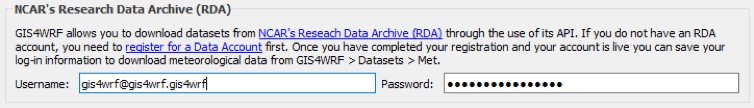

After installation, you can configure GIS4WRF from the `Settings` > `Options...` > `GIS4WRF` menu in QGIS. There you can:

 - Set the working directory for your GIS4WRF projects.
 - Enable integration with WPS/WRF and download pre-built WPS/WRF binaries for Windows, macOS and Linux.
 - Enable integration with NCAR's Research Data Archive.

### Set the working directory

The GIS4WRF working directory is used for storing GIS4WRF projects, datasets and pre-compiled WRF/WPS binaries. The default working directory varies depending on your operating system (OS). The table below shows the default working directory setting for Windows, macOS, and Linux.

| OS Name           | GIS4WRF Default Working Directory  |
|-------------------|------------------------------------|
| Windows           | `C:\Users\<USER>\Documents\gis4wrf`|
| macOS             | `/Users/<USER>/Documents/gis4wrf`  |
| Linux             | `/home/<USER>/gis4wrf`             |

Make sure that you have enough space and have set the correct permissions for the default working directory. You can change the default working directory by clicking on the folder icon.

!!! info "Set the working directory"
    

### Integration with WPS/WRF
If you are looking to use GIS4WRF to run the WPS and WRF programs, you can either set the path to the WPS and WRF folder on your system or, alternatively, ==we support pre-compiled WPS and WRF binaries for Windows, macOS and Linux== (recommended for most cases and new users).

!!! warning "Using WPS/WRF with MPI Support"
    We recommend to download pre-built binaries with MPI support (`dmpar`). Note that you need to have MPI installed on your system ***before*** downloading the pre-built binaries.

    - On Windows, download and install Microsoft MPI (`msmpisetup.exe`) from [https://www.microsoft.com/en-us/download/details.aspx?id=56727](https://www.microsoft.com/en-us/download/details.aspx?id=56727).
    - On macOS you can get it though [Homebrew](https://brew.sh/) using `brew update && brew install mpich`
    - On Linux, use your package manager to download mpich (version ≥ 3.0.4). E.g. on Debian-based systems: `sudo apt-get update && sudo apt-get install mpich`, or on on RPM-based system like CentOS: `sudo yum install mpich`

    After you have downloaded and installed MPI for your system, restart QGIS and check the MPI box ***before*** you download the pre-built binaries.

!!! info "Integration with WPS/WRF"
    

### Integration with NCAR's Research Data Archive

You can set your username and password to access the [NCAR's Research Data Archive](https://rda.ucar.edu/) through the [GIS4WRF Met data downloader](../documentation/#met). If you do not have an account, you can register for one [here](https://rda.ucar.edu/index.html?hash=data_user&amp;action=register).

!!! info "Integration with NCAR's Research Data Archive"
    