# Getting started
!!! tip
    If you are new to GIS4WRF, we recommend you to start with the [tutorials](../tutorials) section.

After you have [installed](../installation) and [configured](../configuration) GIS4WRF, you can find all the features and tools in two separate menus and a single container — referred to as dock. A summary of features and tools is given in the tables below under [Menu items](#menu-items) and [Dock items](#dock-items).

!!! warning "Assumptions"
    GIS4WRF requires users to be familiar with basic concepts of meteorology and numerical modelling. Users should be familiar with the WPS WRF processing workflow. GIS4WRF is meant to simplify and empower users to carry out specialized and time-consuming tasks.

!!! danger "Draft version"
    This documentation is a draft. Please let us know if you find something missing, unclear, or incorrect by [opening an issue on GitHub](https://github.com/GIS4WRF/gis4wrf/issues).

## Menu items
The location and description of each menu item can be found in the tables below.

### Plugins menu

| QGIS Menus                                        | Action                                                |
|---------------------------------------------------|-------------------------------------------------------|
| `Plugins` > `GIS4WRF` > `GIS4WRF`                 | Launch GIS4WRF Dock                                   |
| `Plugins` > `GIS4WRF` > `About`                   | Changelog and license information                     |
| `Plugins` > `GIS4WRF` > `Report a bug`            | Link to GIS4WRF's issue system on GitHub              |

??? info "Click to view the Plugins menu"
    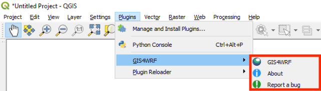

### Layer menu

| QGIS Menus                                        | Action                                                 |
|---------------------------------------------------|--------------------------------------------------------|
| `Layers` > `Add Layer` > `Add WRF NetCDF Layer...`| Load WRF-NetCDF dataset into QGIS                      |
| `Layers` > `Add Layer` > `Add WPS Binary Layer...`| Load WPS Binary dataset into QGIS                      |

??? info "Click to view the Layer menu"
    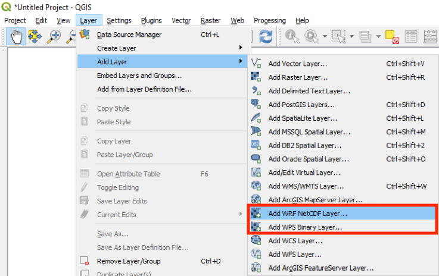

## Dock items
The GIS4WRF dock can be launched from the `Plugins` > `GIS4WRF` > `GIS4WRF` menu. There you can find most of the features and tools to pre-process data, configure domains, run WPS and WRF programs, and visualize your simulation results. The location and description of each tab and sub-tabs can be found in the table below.

| GIS4WRF Dock             | Action                                                                 |
|--------------------------|------------------------------------------------------------------------|
| `Home`                   | View documents and tutorials                                           |
| `Datasets` > `Geo`       | Download WPS geographical datasets                                     |
| `Datasets` > `Met`       | Download meteorological datasets from NCAR's RDA                       |
| `Datasets` > `Process`   | Convert raster data (e.g.  GeoTIFF) into WPS geographical datasets     |
| `Simulation` > `General` | Create or open GIS4WRF projects                                        |
| `Simulation` > `Domain`  | Create, import and export domains                                      |
| `Simulation` > `Data`    | Define geographical and meteorological datasets to use in simulation   |
| `Simulation` > `Run`     | Pre-populate, check and export namelists and run WPS and WRF programs  |
| `View`                   | Visualize and post-process WPS and WRF input or outputs                |

### Home

The home tab is used to provide offline documentation and tutorials.

??? info "Click to view the Home tab"
    

    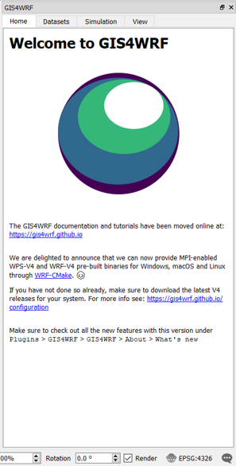
    

### Datasets

The `Datasets` tab is composed of three main subtabs: `Geo`, `Met`, and `Process`. In these subtabs, you can find tools to download standard Geogrid binary datasets (also referred to as 'static data'), download meteorological datasets using the integration with NCAR's Research Data Archive (RDA), and convert geo-referenced data (e.g. GeoTIFF) to Geogrid binary format.

#### Geo
The `Geo` subtab is used to download standard Geogrid binary datasets (i.e.from <http://www2.mmm.ucar.edu/wrf/users/download/get_sources_wps_geog.html>) locally. The Geogrid binary datasets are downloaded and saved in the [GIS4WRF working directory](../configuration/#set-the-working-directory) under `<GIS4WRF_WORKING_DIRECTORY>/datasets/geog `

??? info "Click to view the Geo subtab"
    

    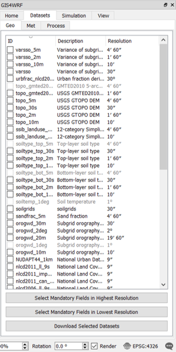
    

#### Met
The `Met` subtab is used to download NCAR datasets supported by WPS from [NCAR's Research Data Archive (RDA)](https://rda.ucar.edu/). A valid RDA account is required to use this utility and the username and password must be set — for more information see the [configuration](../configuration/#integration-with-ncars-research-data-archive) section. A list of currently supported datasets can found in the table below:

| Dataset ID                                        | Description                                           |
|---------------------------------------------------|-------------------------------------------------------|
| `ds083.0` | [NCEP FNL Operational Model Global Tropospheric Analyses, April 1997 through June 2007](https://rda.ucar.edu/datasets/ds083.0/) |
| `ds083.2` | [NCEP FNL Operational Model Global Tropospheric Analyses, continuing from July 1999](https://rda.ucar.edu/datasets/ds083.2/)|
| `ds083.3` | [NCEP GDAS/FNL 0.25 Degree Global Tropospheric Analyses and Forecast Grids](https://rda.ucar.edu/datasets/ds083.3/)|
| `ds084.1` | [NCEP GFS 0.25 Degree Global Forecast Grids Historical Archive](https://rda.ucar.edu/datasets/ds084.1/)|

??? info "Click to view the Met subtab"
    

    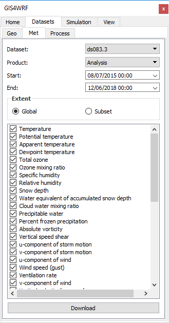
    

When the dataset name is selected, the available product names for the specific dataset become available. Start and end date and time are automatically restricted to the available periods for the specific dataset. Requests can be spatially subsetted by clicking on the `subset` button. When the `Download` button is clicked, the request will be automatically sent to RDA and downloaded when the files become available (Note that if the request is large it may take several minutes before the data becomes available). Data are downloaded and saved in the [GIS4WRF working directory](../configuration/#set-the-working-directory) under `<GIS4WRF_WORKING_DIRECTORY>/datasets/met`.

#### Process

The `Process` subtab contains a tool to convert from QGIS raster layers to WPS binary format data. The tool supports the conversion of both categorical, and continuous data.

??? info "Click to view the Process subtab"
    

    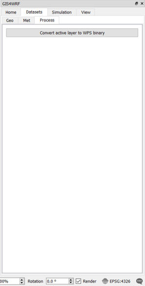
    

### Simulation

The `Simulation` tab contains tools to help you prepare your simulations. Here, you will find four subtabs: `General`, `Domain`, `Data`, and `Run`. In `General`, you can create and open existing GIS4WRF projects. The `Domain`, `Data`, and `Run` subtabs contain tools to help you define and run a WRF simulation such as defining datasets to use in your simulation, configure namelists and run WPS and WRF programs.

#### General
Used to create a new, or to open an existing GIS4WRF project. By default a project is created inside the GIS4WRF default working directory.

??? info "Click to view the General subtab"
    

    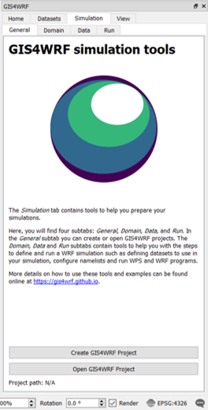
    

#### Domains
Used to easily create, import, and export WRF domains through a GUI interface. This configuration will be used to generate the relevant sections in `namelist.wps` and `namelist.wrf`.

??? info "Click to view the Domain subtab"
    

    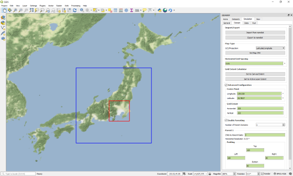
    

- Import/Export

`Import from namelist` button: reads a `namelist.wps` file and populates the fields

`Export to namelist` button: exports domain configuration to a `namelist.wps` file

- Map Type

`GCS/Projection` dropdown: allows users to define the type Geographical Coordinate System (GCS) or Projection to use for creating the domain. Current supported GCS/Projections are `Latitude/Longitude` and `Lambert`. If Lambert option is selected, the two true latitudes (`True Latitude 1` and `True Latitude 2`) are required.

`Set Map CRS` button: set QGIS Project Coordinate Reference System (CRS) based on selected `GCS/Projection`

- Horizontal Grid Spacing

Domain horizontal grid spacing in decimal degrees (°) for `Latitude/Longitude` or in meters (m) for `Lambert`

- Grid Extent Calculator

`Set to Canvas Extent` allows the user to set the domain center-point `Longitude`, `Latitude`, and the grid extent `Horizontal` and `Vertical` to the QGIS canvas extent. The extent can be modified in `Advanced Configuration` (see next section).

`Set to Active Layer Extent` allows the user to set the domain center-point `Longitude`, `Latitude`, and the grid extent `Horizontal` and `Vertical` to the extent of the active layer in QGIS. The extent can be modified in `Advanced Configuration` (see next section).

- Advanced Configuration

When checked, it enables the user to manually set the center-point latitude and longitude in decimal degrees (°), and the horizontal and vertical gird extent for the inner-most domain.

- Enable Parenting

When checked, it enables the user to create nested-type domains. The number of parent domains can be selected (min:1, max:21). The user must set the `child-to-parent ratio` as well as the padding. The horizontal resolution for the parent domain is calculated automatically based on the resolution of the child domain. **NB:** GIS4WRF calculates nesting opposite to the standard way of creating domains in WRF — parent domains are created based on the location, extent and resolution of the child domain.

#### Data
Used to set datasets to be added in the configuration of namelists.

??? info "Click to view the Data subtab"
    

    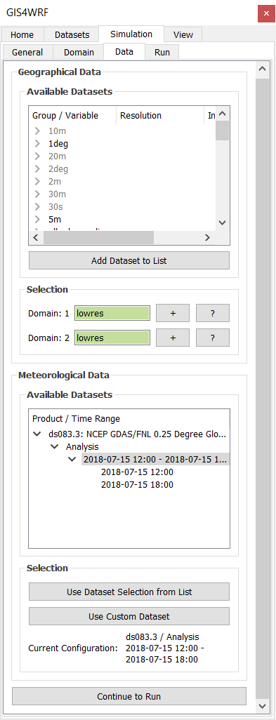
    

- Geographical Data
For each domain, the type of geographical data is selected by clicking on the `+` button next to each domain.
Optionally, under `Add Dataset`, a new dataset can be imported to be used in the simulation. This configuration will be used to generate the relevant section in `namelist.wps` and `GEOGRID.TBL`.

- Meteorological Data
The meteorological data is shown under the `Available Dataset` and added by selecting the dataset and time range to be used in the simulation, and clicking on the `Use dataset selection from list` button. This configuration will be used to generate the relevant sections in `namelist.wps` and `namelist.wrf`.

External or local datasets can be imported using the `Use Custom Dataset` button.

??? info "Click to view how to import external met datasets"
    

    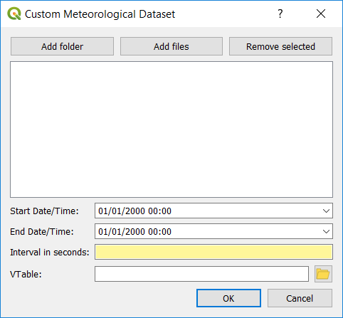
    

#### Run
The run tab is used to run WPS and WRF programs with the configuration generated by GIS4WRF. Sections of namelists such as physics options can be edited by clicking on the `Open Configuration` button. The output is displayed in the integrated `Program output` window.

??? info "Click to view the Run subtab"
    

    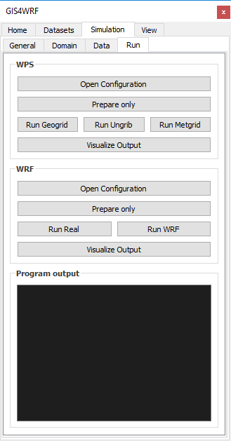
    

### View Tab
WRF NetCDF datasets can be opened under  `QGIS` > `Layers` > `Add Layer` > `Add WRF NetCDF Layer...`. Variables included in WRF NetCDF datasets are shown as a list in the *View* tab. The time slider at the end of the list of variables provides a fast way to slice through different time stamps. For variables that include vertical levels, the `Vertical Level` dropdown menu will become selectable.

??? info "Click to view the View tab"
    

    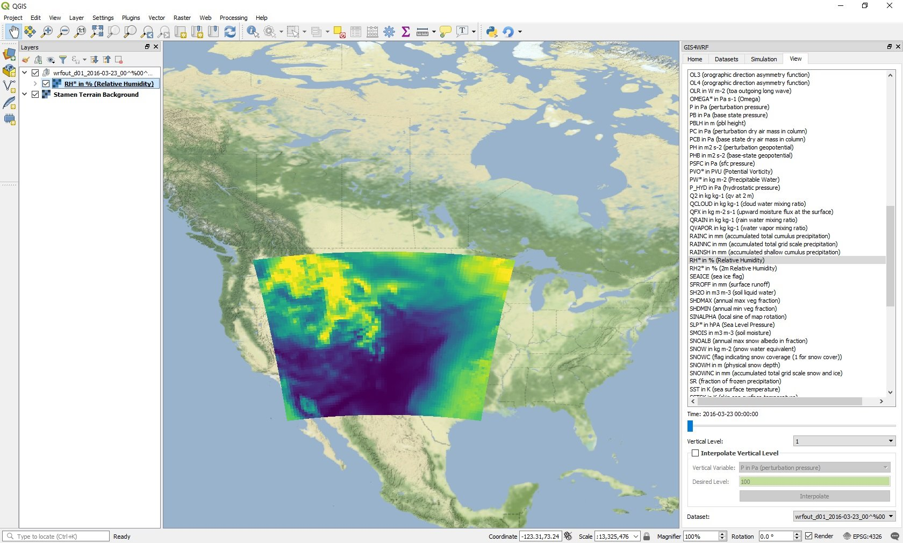
    

- Integration with wrf-python
We currently provide the following additional features using wrf-python:

- Vertical Interpolation of Variables
- Generation of Derived Variables

- Vertical Interpolation of Variables
Currently we offer integration with the vertical interpolation functions provided by wrf-python. Vertical interpolation options can be selected by selecting the variable name and enabling the `Interpolate Vertical Level` check-box.

- Generation of Derived Variables
The following variables are derived using wrf-python:

|Variable Name | Description |
|--------|------|
|AVO|Absolute Vorticity|
|DBZ|Radar Reflectivity|
|ETH|Equivalent Potential Temperature|
|GEOPT|Geopotential for Mass Grid|
|HELICITY|Storm Relative Helicity|
|MDBZ|Maximum Radar Reflectivity|
|Omega||
|PVO|Potential Vorticity|
|PW|Precipitable Water|
|RH|Relative Humidity|
|RH2|Relative Humidity at 2 m|
|SLP|Sea Level Pressure|
|TC|Temperature|
|TD|Dew Point Temperature|
|TD2|Dew Point Temperature at 2 m|
|TH|Potential Temperature|
|TH2|Potential Temperature at 2 m|
|TK| Temperature|
|TV|Virtual Temperature|
|TWB|Wet Bulb Temperature|
|UA|U-component of Wind on Mass Points|
|VA|V-component of Wind on Mass Points|
|WA|W-component of Wind on Mass Points|
|Z|Model Hight|