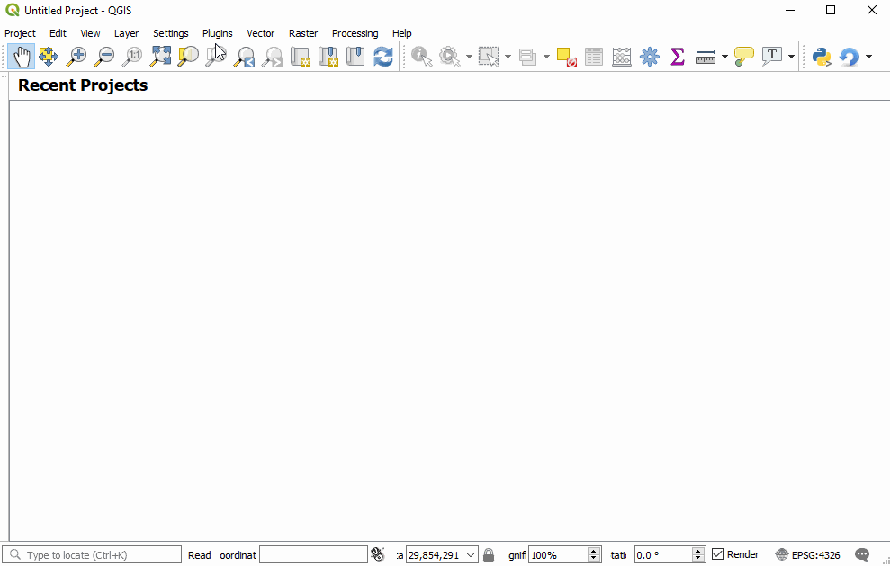

# Welcome to GIS4WRF

Here you can find installation instructions, documentation and tutorials for the [GIS4WRF plug-in](https://github.com/GIS4WRF/gis4wrf) ([@Meyer and Riechert 2019]; [@Meyer and Riechert 2018]).

GIS4WRF is a free and open source QGIS plug-in to help researchers and practitioners with their [Advanced Research Weather Research and Forecasting](https://www.mmm.ucar.edu/weather-research-and-forecasting-model) ([@Skamarock et al. 2008]) modelling workflows. GIS4WRF can be used to pre-process input data, run simulations and visualize or post-process results on Windows, macOS, and Linux.

!!! info "Pre-built binaries with WRF-CMake"
    Did you know that we provide pre-built binaries for Windows, macOS and Linux through [WRF-CMake](https://github.com/WRF-CMake)? To know how to download and use them in GIS4WRF see the [Documentation](documentation) section. If you are looking to download the pre-built WPS/WRF programs separately go to [https://github.com/WRF-CMake](https://github.com/WRF-CMake).

## Quick start

If you are familiar with [QGIS](https://qgis.org/) and have installed the **latest version** of **QGIS 3** on Windows, you can find and install GIS4WRF from the `Plugins` > `Manage and Install Plugins...` menu. On macOS and Linux, or if you are new to QGIS or GIS4WRF, please see the [installation page](../installation). If you want to know how to download pre-built binaries for WPS and WRF so that you can run simulations on Windows, macOS and Linux, see the [Configuration](../configuration) section. To learn how to use GIS4WRF see the [Documentation](../documentation) or [Tutorials](../tutorials) sections.

[@Meyer and Riechert 2019]: cite "D. Meyer, & M. Riechert. (2019). Open source QGIS toolkit for the Advanced Research WRF modelling system. Environmental Modelling & Software, 112, 166–178. https://doi.org/10.1016/j.envsoft.2018.10.018"

[@Meyer and Riechert 2018]: cite "D. Meyer, & M. Riechert. (2018). The GIS4WRF Plugin. Zenodo. https://doi.org/10.5281/zenodo.1288569"

[@Skamarock et al. 2008]: https://dx.doi.org/10.5065/D68S4MVH "Skamarock, W. C., Klemp, J. B., Dudhia, J., Gill, D. O., Barker, D. M., Duda, M. G., Huang, X.-Y., Wang, W. and Powers, J. G.. (2008). A Description of the Advanced Research WRF Version 3. NCAR Technical Note NCAR/TN-475+STR, p. 113. https://doi.org/10.5065/D68S4MVH"