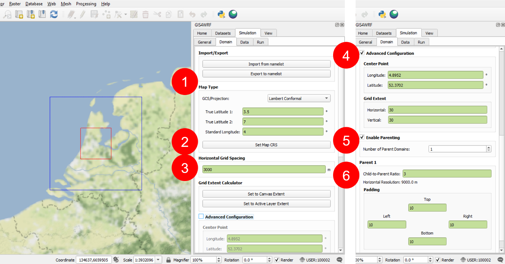

# The 2018 European heat wave

<p align="center">

</p>
<p align="center">
MODIS Corrected Reflectance imagery for the 15 July 2018 (<a href="https://modis.gsfc.nasa.gov/data/dataprod/mod09.php">@NASA</a>).
</p>

In this example tutorial we show how to use GIS4WRF to easily and quickly download data, configure WPS and WRF namelists for a *real* case, and run a WRF simulation on your local machine using the [pre-built binaries provided](../../../configuration/#integration-with-wpswrf). We simulate 6 hours, for an area centered in Amsterdam, for the 15 July 2018 (12:00 - 18:00) related to [the heat wave that affected the Netherlands between the 15 and 27 July 2018](https://en.wikipedia.org/wiki/2018_European_heat_wave#Netherlands). You should be able to complete this tutorial in less than 20 minutes, including simulation. On an average machine, dual core @ 2.4 GHz with 8 GB of RAM, this 6-hour simulation should take no more than 5 minutes to complete.

!!! warning "Checklist before you begin"
    - [x] You have followed our instructions to [install](../../../installation) and [configure](../../../configuration) GIS4WRF.
    - [x] You have enabled the [integration with WPS/WRF](../../../configuration/#integration-with-wpswrf) and downloaded the latest pre-built binaries. If you are running using MPI-enabled binaries, make sure that the number of `MPI processes` does not exceed `6`.
    - [x] You have enabled the [integration with NCAR's Research Data Archive](../../../configuration/#integration-with-ncars-research-data-archive).

## Overview
The whole process from configuration to running the simulation and visualization of outputs will take no more than 20 minutes on an average machine. This process can be broken down in the following six steps:

- Create project
- Define domain
- Download input data
- Select input data
- Configure and run
- View results

## Create project
From QGIS launch GIS4WRF from the `Plugins` > `GIS4WRF` menu. Create a new GIS4WRF project by going to `Simulation` > `General` and clicking on `Create a GIS4WRF Project` (1). A new window will appear. Create a new folder named `2018_07_15_Amsterdam` (2) and click on `Select Folder` (3).

!!! info ""
    

 Note that after a project is created, the `Project Path` will point to the project folder.

!!! info "Never lose your configuration settings!"
    Any settings are automatically saved by GIS4WRF and stored in your project file.

## Define domain
Navigate to `Simulation` > `Domain` and fill the sections as follows:

- GCS/Projection: `Lambert Conformal`
- True Latitude 1: `3.5`
- True Latitude 2: `7`
- Standard Longitude: `4`

Click on `Set Map CRS`

- Horizontal Grid Spacing: `3000`

Enable (tick) `Advanced Configuration`

- Center Point Longitude: `4.8952`
- Center Point Latitude: `52.3702`
- Grid Extent (Horizontal): `30`
- Grid Extent (Vertical): `30`

Enable (tick) `Parenting`

- Child-to-Parent Ratio: `3`
- Padding (Top, Right, Bottom, Left): `10`


!!! info ""
    

You can view the domain layers individually by clicking and expanding the domain group (1) and focus on the region of study by right-clicking on the `WRF Domains (Vector)` group and `Zoom to Group` (2).

!!! info ""
    

!!! warning
    GIS4WRF defines domains from the inside out. This allows you to have full control on positioning the inner-most domain.

## Download input data
Two datasets are needed to run WRF:

1. Geographical data used by the WRF Preprocessing System (WPS), and
2. Meteorological data used to create initial and boundary conditions.

Download of [geographical data](#geographical-data) and [meteorological data](#meteorological-data) can be carried out in parallel -- i.e. you can start downloading [meteorological data](#meteorological-data) even if the [geographical data](#geographical-data) has not finished downloading. However, ==you *must* wait until both meteorological and geographical data have been fully downloaded before proceeding to the [Select input data](#select-input-data) section==.

!!! info
    We choose to download datasets *after* defining the domain so that its coordinates can be used to subset our request, thus reducing the amount of data to download.

### Geographical data

Navigate to `Dataset` > `Geo`. Click on `Select Mandatory Fields in Lowest Resolution` and `Download Selected Datasets`. Once the download is complete go to [meteorological data](#meteorological-data).

!!! info ""
    

!!! info
    Depending on your internet connection, the download can take a few minutes.

### Meteorological data

To download the meteorological data navigate to `Dataset` > `Met` and select:

- Dataset: `ds083.3`
- Product: `Analysis`
- Start: `15/07/2018 12:00` (for US datetime format: `7/15/18 12:00 PM`)
- End: `15/07/2018 18:00`   (for US datetime format: `7/15/18 06:00 PM`)

Under `Extent` click on subset, then select `Domain 2` on the `Layers` panel (2) and click on `Set from Active Layer` (3) to subset your request. Finally, click `Download` to submit and download your request. Once the download is complete go to [Select input data](#select-input-data).

!!! info ""
    

!!! info
    Depending on your internet connection and the data request preparation on NCAR's Research Data Archive servers, the download can take a few minutes.


## Select input data
GIS4WRF automatically pre-populates WPS and WRF namelists based on your domain configuration and data selection. Go to `Simulation` > `Data`. As you already have downloaded geographical and meteorological data, simply type `lowres` in the `Domain 1` and `Domain 2` fields (1) and click on `2018-07-15 12:00 - 2018-07-15 18:00` (2) and `Use Dataset Selection from List` (3) to select the meteorological data.

!!! info ""
    

## Configure and run
There are two main processes involved in running a real-case simulation: configure and run the WRF Preprocessing System (WPS), and configure and run WRF.

### WPS
WPS comprises of three programs: Geogrid, Ungrib, and Metgrid. As GIS4WRF pre-populates namelists for you, you can directly go to `Simulation` > `Run` and click on the `Geogrid`, `Ungrib`, and `Metgrid` buttons individually.

!!! info ""
    

At the end of each program you will receive the following prompt from Geogrid (1), Ungrib (2), and Metgrid (3).

!!! info ""
    

### WRF
There are two programs you will need to run: Real and WRF.
GIS4WRF already pre-populates most of the namelist used by Real and WRF (`namelist.input`) for you, however it will *not* select physics and dynamics options for you by design — after all, this is meant to be science so you should know the options to choose.

For this tutorial, however, I have pre-selected the options for you. Click on `Open configuration` (1) and replace all values in the configuration window (2) with the `namelist.input` file below (simply copy and paste) and click on `Save` (3).

!!! note "`namelist.input`"
    ```
    &time_control
        start_year = 2018, 2018
        start_month = 7, 7
        start_day = 15, 15
        start_hour = 12, 12
        end_year = 2018, 2018
        end_month = 7, 7
        end_day = 15, 15
        end_hour = 18, 18
        interval_seconds = 21600
        input_from_file = .true., .true.
        history_interval = 10, 10
        frames_per_outfile = 100, 100
        restart = .false.
        restart_interval = 7200
        io_form_history = 2
        io_form_restart = 2
        io_form_input = 2
        io_form_boundary = 2
        start_minute = 0, 0
        start_second = 0, 0
        end_minute = 0, 0
        end_second = 0, 0
        nocolons = .true.
    /

    &domains
        time_step = 40
        time_step_fract_num = 0
        time_step_fract_den = 1
        max_dom = 2
        e_we = 31, 31
        e_sn = 31, 31
        e_vert = 33, 33
        p_top_requested = 5000
        num_metgrid_levels = 32
        num_metgrid_soil_levels = 4
        dx = 9000.0, 3000.0
        dy = 9000.0, 3000.0
        grid_id = 1, 2
        parent_id = 1, 1
        i_parent_start = 1, 11
        j_parent_start = 1, 11
        parent_grid_ratio = 1, 3
        parent_time_step_ratio = 1, 3
        feedback = 1
        smooth_option = 0
    /

    &physics
        physics_suite = 'CONUS'
        mp_physics = 0, 0
        cu_physics = 0, 0
        radt = 9, 3
        bldt = 0, 0
        cudt = 0, 0
        icloud = 0
        num_land_cat = 21
        sf_urban_physics = 1, 1
    /

    &dynamics
        hybrid_opt = 2
        w_damping = 0
        diff_opt = 1, 1
        km_opt = 4, 4
        diff_6th_opt = 0, 0, 0
        diff_6th_factor = 0.12, 0.12
        base_temp = 290.0
        damp_opt = 3
        zdamp = 5000.0, 5000.0
        dampcoef = 0.2, 0.2
        khdif = 0, 0
        kvdif = 0, 0
    /

    &bdy_control
        spec_bdy_width = 5
        specified = .true.
    /

    &namelist_quilt
    /

    ```

!!! info ""
    


Now you are good to go, run `Real` and `WRF` (1). At the end of each program you will receive the following prompt from Real (2) and WRF (3).


!!! info ""
    


## View results
After the simulation is complete, click `Visualize Output` (1), select  the file `wrfout_d01_2018-07-15_12_00_00` (2) and click `Open`.

!!! info ""
    

Images are displayed geo-referenced on the map canvas. You can change the variable to display (1), slice through the simulation time-steps (2), and change the color scheme by double-clicking on the layer (3) and going into `Symbology`.

!!! info ""
    
